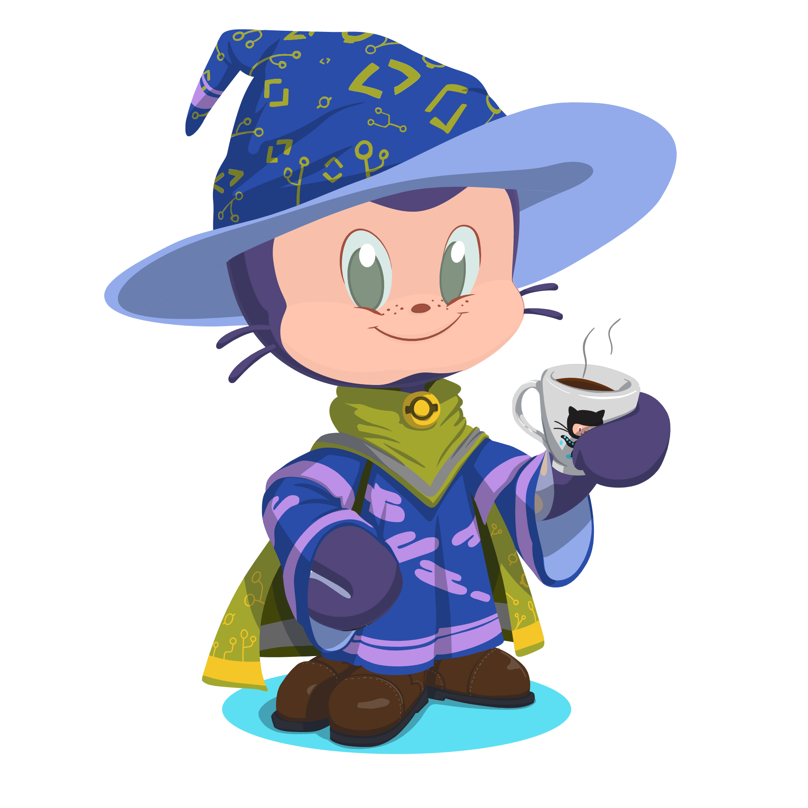
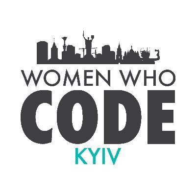

## TL;DR

| | |
|---|---|
| **Name** | Julia Kuzniecowa (Юлія Кузнєцова /Yuliia Kuznietsova) |
| **Born** | September 25, 1984 |
| **Nationality** | Ukrainian |
| **Residence** | Poland |
| **Languages** | Ukrainian, Russian, English, Polish |
| **Education** | BE, Industrial and Civil Engineering |
| **Occupation** | Technical Writer |
| **Skills** | Manuals, API documentation, How-To's, User's Guides, Release Notes, Software Documentation;   HTML, CSS, JavaScript, Kanban, XML, Markdown, Jira, Confluence, Git, Postman/Swagger, JSON |
| **Interested in** | Docs-as-code approach, Web Accessibility, Diversity |
| **Preferences** | Startups, Software houses |
| **Social** | <a href="https://www.linkedin.com/in/yulios/">Lnkdn</a> // <a href="https://github.com/YuliyaLios">GitHub Profile</a> |
| **Download** | [My prettified CV.pdf](CV-TechWriter-JuliaKuzniecowa.pdf) |

## Work Experience

###  Technical Writer, <a href="https://corefy.com/">Corefy</a>

> Aug 2019 – Present (*3 yrs*)

* Developed and maintained documentation for external (clients) and internal (developers) users.
* Studied drawings, specifications, mockups and product samples to integrate and delineate technology, operating procedure, production sequence and detail. 
* Interviewed production and engineering personnel to become familiar with product technologies and production methods. 
* Standardised and made changes to material prepared by managers and developers. 
* Selected photographs, drawings, and sketches and made diagrams and charts to illustrate the material.
* Provided manual testing, made interface localisation and helped develop software architecture documentation. 

###  Head Of Content, <a href="http://vintage.agency/">Vintage Web Production</a>

> Sep 2017 – Jul 2019 (*1 yr 11 mos*)

* Reviewed and updated web pages' content. 
* Administered Internet and intranet infrastructure, including Web, file and mail servers. 
* Performed user testing and usage analyses to determine sites' effectiveness and usability. 
* Gathered, analysed and documented user feedback to locate and resolve sources of problems. 
* Collaborated with development teams to discuss, analyse and resolve usability issues. 
* Provided training and technical assistance in Web site implementation and use. 
* Documented installation or configuration procedures to allow maintenance and repetition.

### Website Administrator, Content Manager, & HTML Coder, budcenter.net

> Aug 2016 – Sep 2017 (*1 yr 2 mos*)

*  Administered Internet and intranet infrastructure, including Web, file and mail servers. 
* Reviewed or updated web pages' content. Tested issues such as system integration, performance and security on a regular schedule and after major program modifications. 
* Provided manual testing, made interface localisation and helped develop software architecture documentation.
* Determined sources of web page or server problems and took action to correct problems. 
* Identified and documented backup and recovery plans.

### Engineer Estimator

> Sep 2009 – Nov 2012 & Sep 2004 – Apr 2006 (*more than 5 yrs*)

* Wrote and checked construction expertise reports.
* Calculated and verified civil building projects' estimates.
* Assessed the state of buildings and constructions.
* ProvideD consultation about existing regulatory and technical documentation.

## Volunteering for

### Girls.js Poland 

> 2022.10 - Present

Co-organizer JavaScript programming workshops introducing women to the IT field.

###  WWCode Kyiv

> 2019 – Present

Education, Inspiring and Supporting Women to excel in technology careers

### Kherson New Generation (NGO)

> 2000 – 2005

Children's Leadership Mentoring, Civil Rights and Social Action

## Education

### Full Stack Web Development, freeCodeCamp

> 2016

### Web Development, Go FrontEnd program from <a href="https://goit.ua/">GoIT</a>

> 2016

### Industrial and Civil Engineering, Kherson State Agrarian University

> 2001-2009
